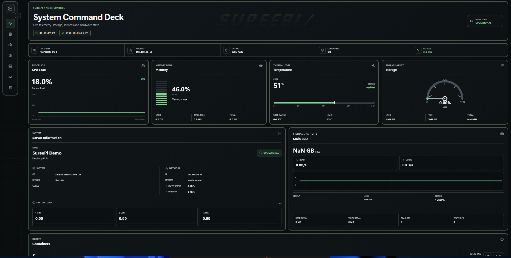
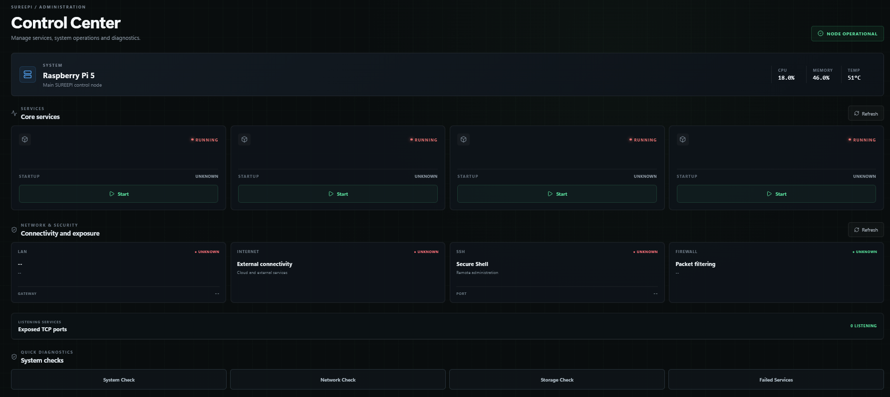
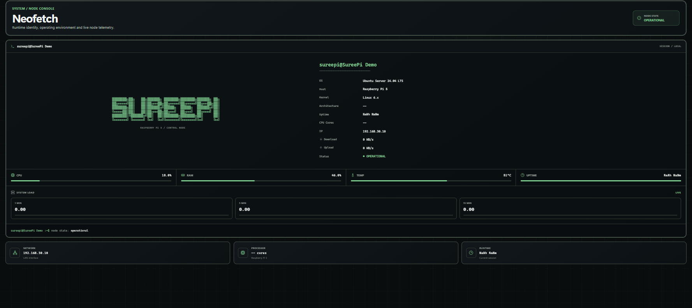
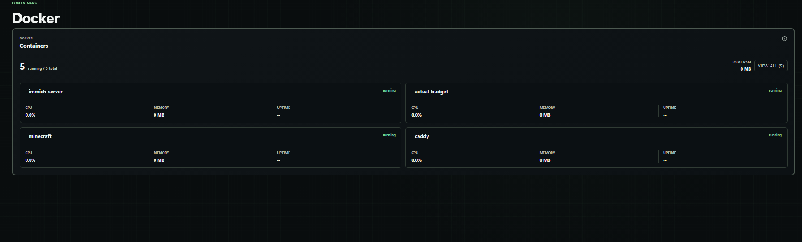
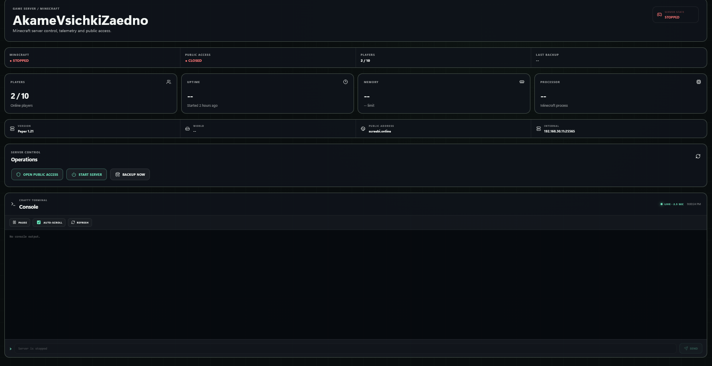
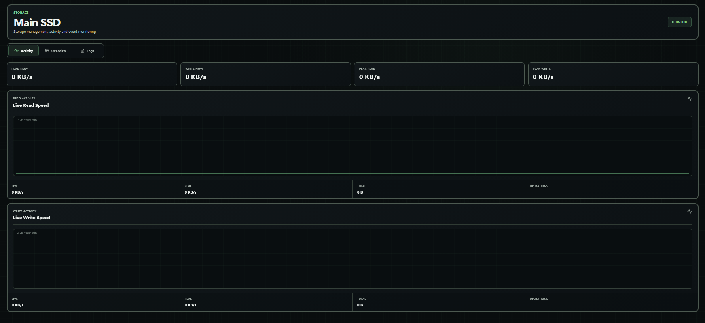
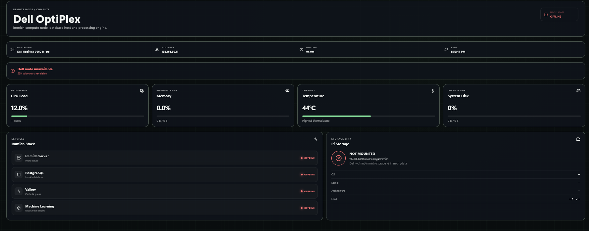

# SureePi Infrastructure Dashboard

SureePi is a React + Vite dashboard for monitoring a self-hosted homelab node. This repository is a safe portfolio/demo version of the original dashboard: it keeps the frontend experience, but replaces the private backend with realistic mock data.



## What It Shows

- Live-style system telemetry for CPU, memory, storage and temperature
- Docker container overview
- Storage activity and event log views
- Raspberry Pi system details
- Secondary Dell node status
- Minecraft server status and console-style controls
- Admin control panel UI with simulated actions
- PWA-ready configuration

## Preview

| Control Center | System Console |
| --- | --- |
|  |  |

| Docker | Minecraft |
| --- | --- |
|  |  |

| Storage | Additional Node |
| --- | --- |
|  |  |

## Demo Safety

The real dashboard runs against a private backend on a home server. This public version does not include that backend, any databases, credentials, private IP configuration, or real control access.

All `/api/*` requests are intercepted in the browser by `src/demo/mockApi.js`, which returns demo data and simulated success responses. Buttons such as service restart, power actions and Minecraft controls do not touch any real infrastructure.

## Tech Stack

- React
- Vite
- React Router
- Recharts
- Lucide React
- Vite PWA
- Plain CSS

## Project Structure

```text
src/
  admin/              Dashboard shell and page layout
  components/         System, storage, Docker and control panels
  demo/               Browser-side mock API
  minecraft/          Minecraft dashboard page
  App.jsx             Dashboard-only routing
  main.jsx            App entry point and demo API bootstrap
```

## Run Locally

```bash
npm install
npm run dev
```

Then open the local Vite URL shown in the terminal.

## Build

```bash
npm run build
```

## Demo Mode

Demo mode is enabled by default:

```env
VITE_DEMO_MODE=true
```

Set `VITE_DEMO_MODE=false` only in a private environment with a compatible backend.

## Notes

This project was extracted from a working homelab dashboard and reduced to a dashboard-only public version. The goal is to show the frontend, UI structure and infrastructure-monitoring workflow without exposing the real server.
